# VERSEVA Design

The VERSEVA design signature as an installable package (npm: `@verseva/design`): design tokens, a component contract
shipped as CSS, Tailwind bridges, a rendered design board, and a build gate that fails CI on any
hand-picked color. One system; every brand fills the values.

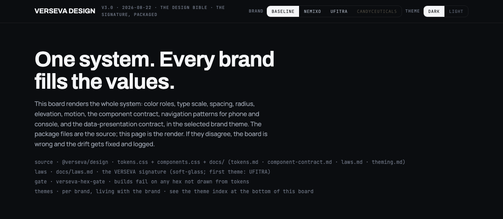

## What's in the box

| File | What |
|---|---|
| [`tokens.css`](tokens.css) | The signature: color/type/spacing/radius/elevation/motion/data-viz roles + the soft-glass material tokens. Dark default, one `[data-theme="light"]` flip block |
| [`components.css`](components.css) | The component contract as framework-light CSS classes, every contract state included |
| [`tailwind.css`](tailwind.css) | Tailwind v4 bridge (`@theme inline` role mapping) |
| [`tailwind.preset.cjs`](tailwind.preset.cjs) | Tailwind v3 preset |
| [`bin/hex-gate.mjs`](bin/hex-gate.mjs) | `verseva-hex-gate`: the build fails on any hex not drawn from tokens |
| [`bin/verseva-gate.mjs`](bin/verseva-gate.mjs) | `verseva-gate`: the full suite in one run: hex + contrast + spacing + type (each also standalone: `verseva-contrast-gate`, `verseva-spacing-gate`, `verseva-type-gate`) |
| [`docs/`](docs/) | [tokens.md](docs/tokens.md) · [component-contract.md](docs/component-contract.md) · [laws.md](docs/laws.md) · [theming.md](docs/theming.md) |
| [`board/`](board/) | The design board: the live render of everything on this page (`npm run board`). Repo clone only: not shipped in the npm package |

## Install

Pin a release tag; `main` moves ahead of the tags:

```bash
npm i -D "git+ssh://git@github.com/verseva/design.git#v0.1.1"
```

(`#semver:^0.1.1` also works and tracks compatible tags.) CI environments without SSH access
to this private repo can vendor a packed tarball instead:

```bash
npm pack path/to/this-repo-clone --pack-destination vendor
npm i -D ./vendor/verseva-design-0.1.1.tgz
```

> Known issue: Next.js/Turbopack panics on npm's symlinked `file:` installs
> ("leaves the filesystem root"). Install from git or from a packed tarball, never
> `npm i -D file:../<clone>` directly.

## Quick start

**Tailwind v4** (one import; utilities become on-token: `bg-surface`, `text-text-2`,
`border-hairline`, `rounded-lg`, `shadow-2`):

```css
/* globals.css */
@import "tailwindcss";
@import "@verseva/design/tailwind.css";
```

**Tailwind v3** (two steps: the preset maps names only; `tokens.css` supplies the values —
the v4 bridge does this import internally):

```js
// tailwind.config.js
module.exports = { presets: [require('@verseva/design/preset')] };
```

```css
/* globals.css */
@import "@verseva/design/tokens.css";
```

**Any other surface** — no build step (plain HTML, a deck, a prototype); bare package
specifiers only resolve under a bundler, so link the files directly:

```html
<link rel="stylesheet" href="node_modules/@verseva/design/tokens.css">
<link rel="stylesheet" href="node_modules/@verseva/design/components.css">
```

(In a bundled project's CSS, `@import "@verseva/design/tokens.css";` works as-is.)

Note: `tokens.css` and the Tailwind bridges carry values only. Contract STATES (`:disabled`,
loading, the state recipes) ship in `components.css`; skip it and your own component layer
owes the full state set (see the consumption note in
[docs/component-contract.md](docs/component-contract.md)).

**Fonts** — the signature faces are Archivo, Manrope, and JetBrains Mono. The package names
them but does not ship them; load the variable weights (the tokens use in-between weights like
650/620) or the whole system falls back to system faces:

```html
<link rel="preconnect" href="https://fonts.googleapis.com">
<link rel="preconnect" href="https://fonts.gstatic.com" crossorigin>
<link rel="stylesheet" href="https://fonts.googleapis.com/css2?family=Archivo:wght@100..900&family=Manrope:wght@200..800&family=JetBrains+Mono:wght@100..800&display=swap">
```

(Self-hosting the three families works the same; keep the family names.)

Theme axis: dark is the default; `<html data-theme="light">` flips the whole page in one block.
Brand axis: `<html data-brand="<slug>">` + the brand's `theme.css` (see [Theming](#theming)).
Spacing rides the 4px base: the on-scale Tailwind utilities are `p-1, p-2, p-3, p-4, p-6, p-8,
p-12, p-16, p-24, p-32` = `--s-1`…`--s-10`. Other steps (`p-5`, `p-7`, …) exist in Tailwind but
are off the craft scale; treat them as drift.

## Foundations

### Color roles

Roles are fixed portfolio-wide; themes supply values. Ladders for canvas, hairline, and text;
one accent per brand with a usage budget. The board computes every contrast pair live; a
failing pair does not ship (floors: 4.5:1 body, 3:1 large text and UI parts).

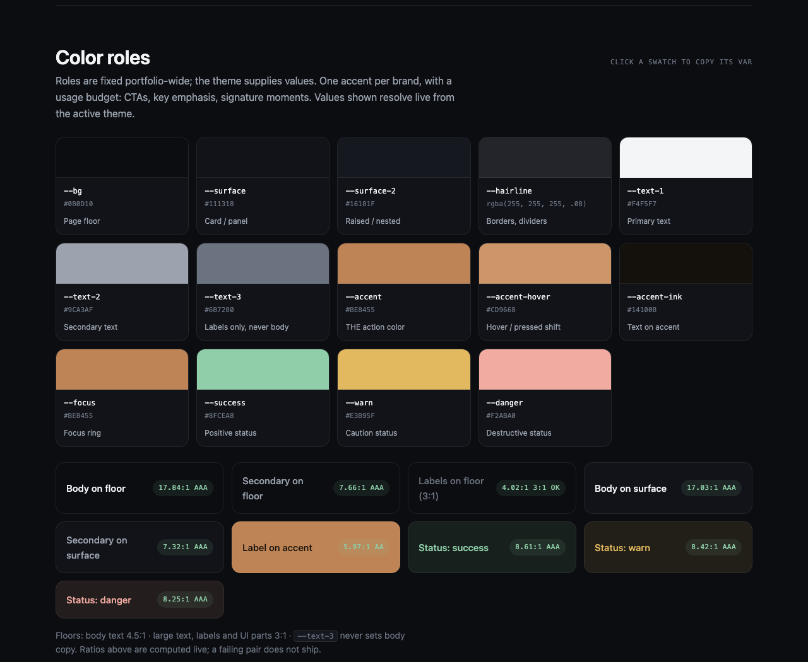

The light theme is the same tokens re-valued in one flip block, nothing per-screen:

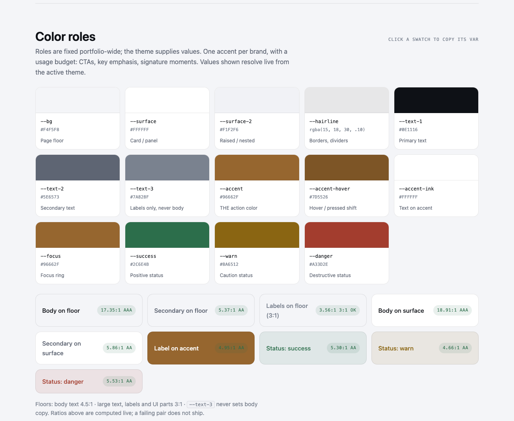

### Type

Archivo display / Manrope body / JetBrains Mono for machines. Scale ~1.25 on a 16px base.
TYPE LAW: mono only for machine artifacts (IDs, codes, timers, chart microlabels); everything
a human reads is body.

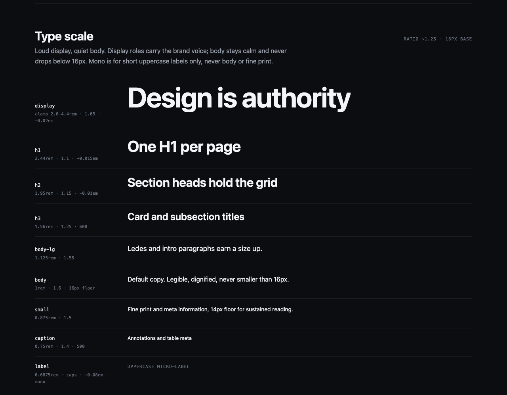

### Spacing

4px base; the scale is the only source of spatial values. SEAM LAW: sections breathe
(section→section ≥18px on product surfaces, 96–128px rhythm on marketing).

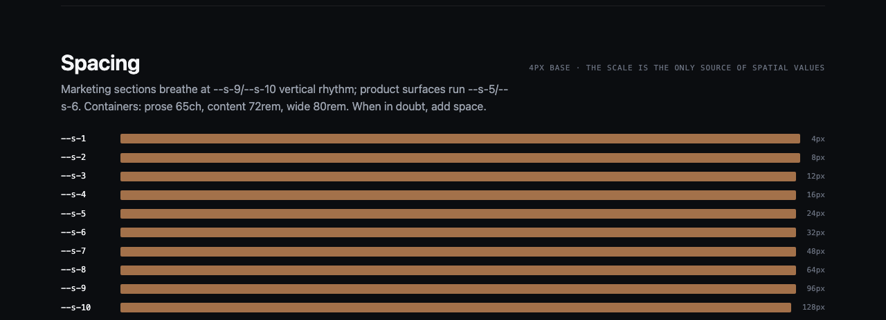

### Radius and elevation

Soft-large posture by default; the Baseline mapping is `--r-sm` 10 / `--r-md` 14 / `--r-lg` 22
/ `--r-pill`, with `--r-btn` riding `--r-md`. Themes re-posture consciously and apply ONE
posture everywhere. Elevation is hairline-first: structure from borders, shadows reinforce.

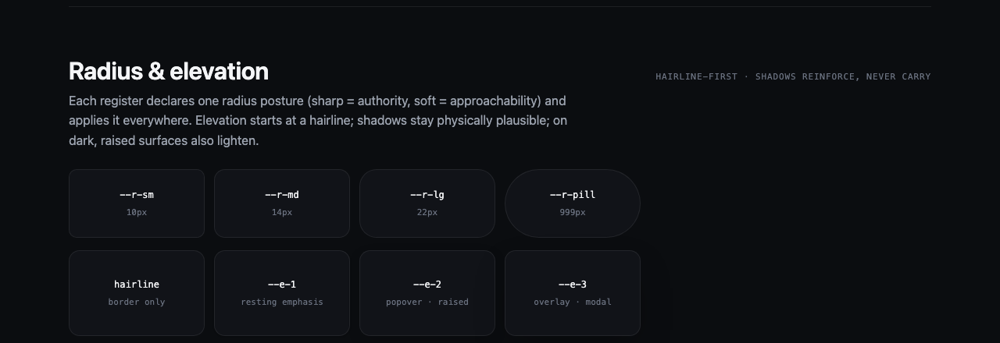

### Motion

Four durations, four easings, transform + opacity only, `prefers-reduced-motion` honored.
Press feedback on tactile controls runs at `--dur-1` (full press doctrine:
[docs/laws.md](docs/laws.md)).

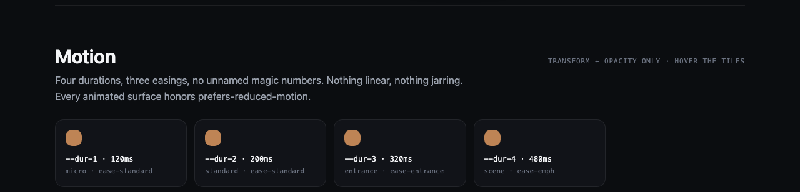

## Components

Every class below ships from [`components.css`](components.css) with all contract states:
default / hover / active / focus-visible / disabled, plus loading and error where the component
can load or fail. Full spec per component: [docs/component-contract.md](docs/component-contract.md),
including the global floor (44px touch targets, keyboard paths, never color-alone, and
view-first-edit-on-intent for single-record surfaces).

### Button — one contract, any brand

The same `.btn` markup under four different themes:

| Signature (Baseline) | UFITRA theme |
|---|---|
| 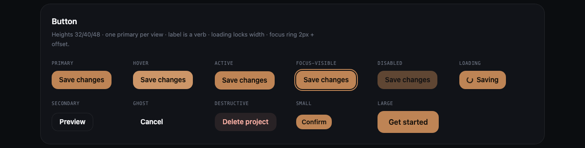 | 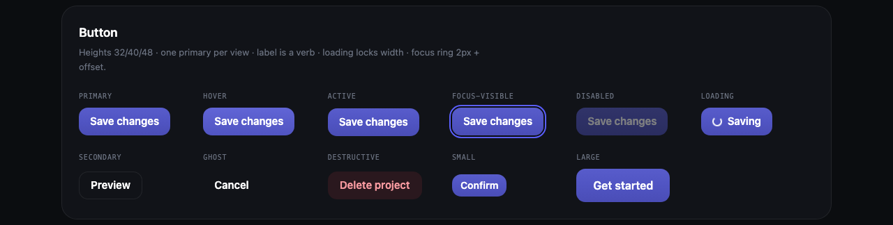 |

| NEMIXO theme | CandyCeuticals theme |
|---|---|
| 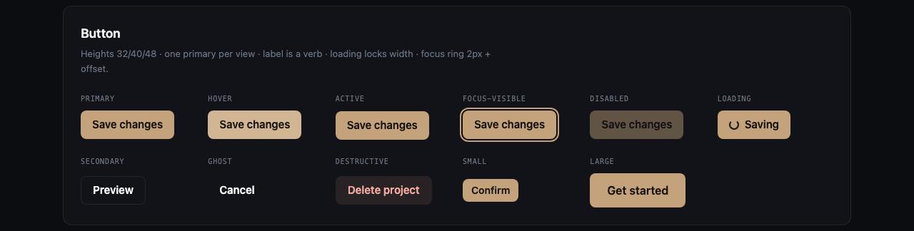 | 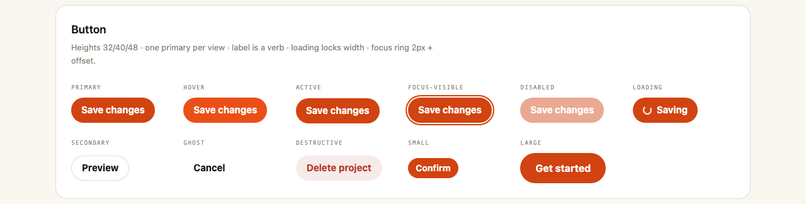 |

Hierarchy comes from FILL, never size: a primary/secondary pair sits equal-sized. One primary
per view.

### Inputs and selection — `.field`, `.sel`, `.switch`

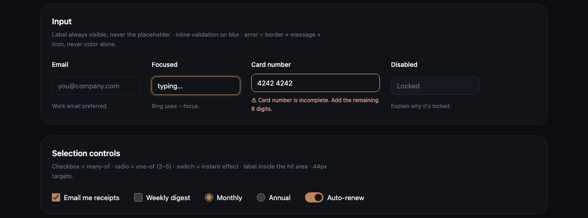

### Wayfinding — `.seg`, `.fchip`, `.searchbox`

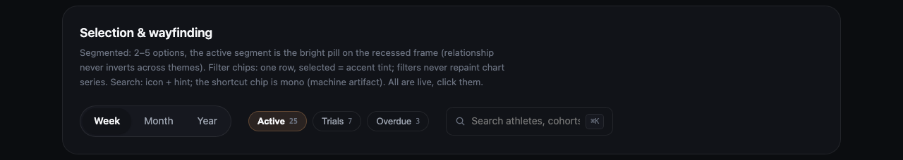

### List rows and identity — `.lrows`, `.lrow`, `.metaline`, `.avc`

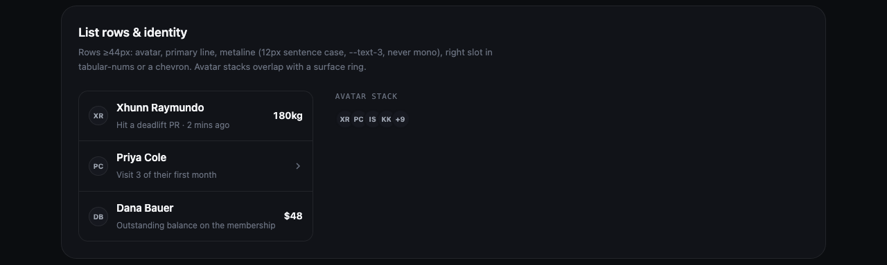

### Card and top navigation — `.card`, `.topnav`

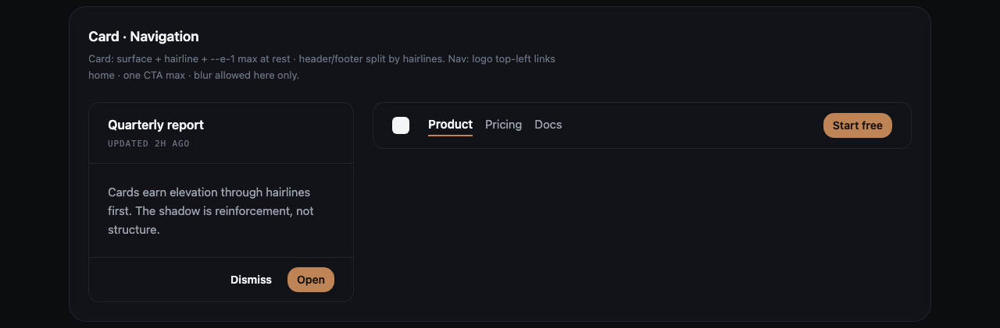

### Table and badges — `.table`, `.badge`

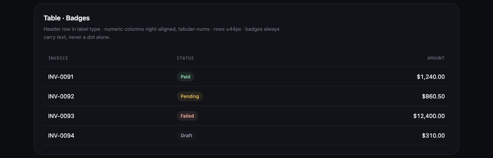

### Toast, modal, sheet — `.toast`, `.modal`, `.sheet`

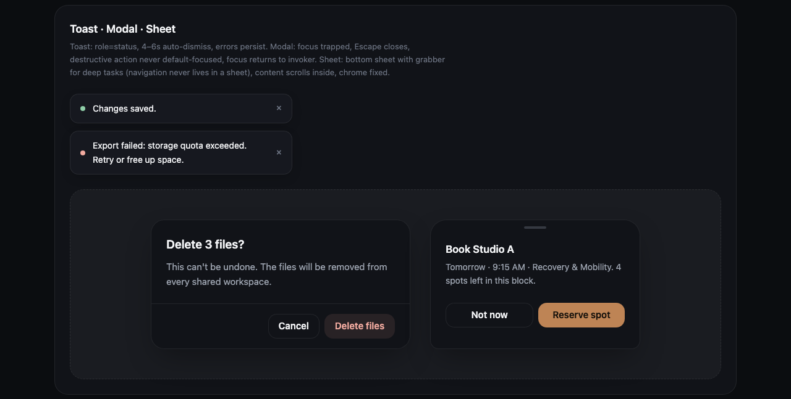

### The states trio — every data surface

Empty says what belongs here plus one action; loading mirrors the real layout (`.skel`);
error says what failed plus retry. Never a bare "No data".

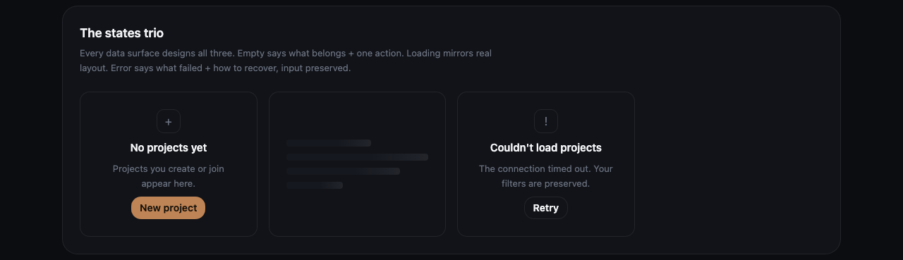

## Navigation patterns

### The navshell (mobile) — the signature's most particular component

Copy it, never approximate it: `components.css` carries the 1:1 port. A frosted container
frames an inset main pill with a 6px gap; tiers separate by shade, never a hairline; tabs are
icon-only and the active tab opens its label inside the accent bloom.

The nav-tier-brightness law is MODE-SPECIFIC — light: bright main pill on a recessed grey
frame; dark: inverted, lighter frame, darker recessed pill:

| Dark (frame lighter, pill recessed) | Light (pill leads, frame recessed) |
|---|---|
| 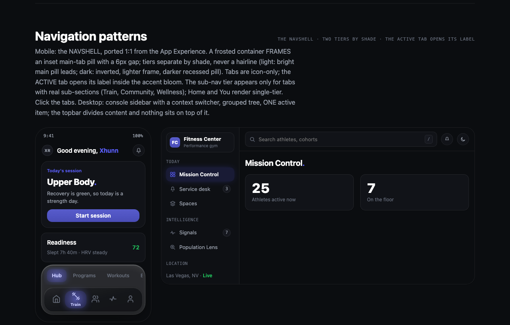 | 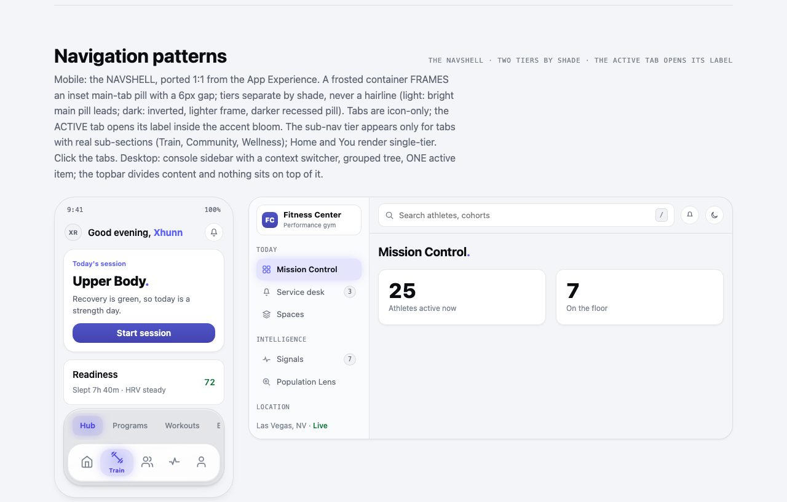 |

### Console navigation (desktop) — `.snav`, `.orgchip`, `.grouplabel`

Org switcher on top, grouped tree with mono section labels, ONE active item on an accent-tinted
pill, counts as badges:

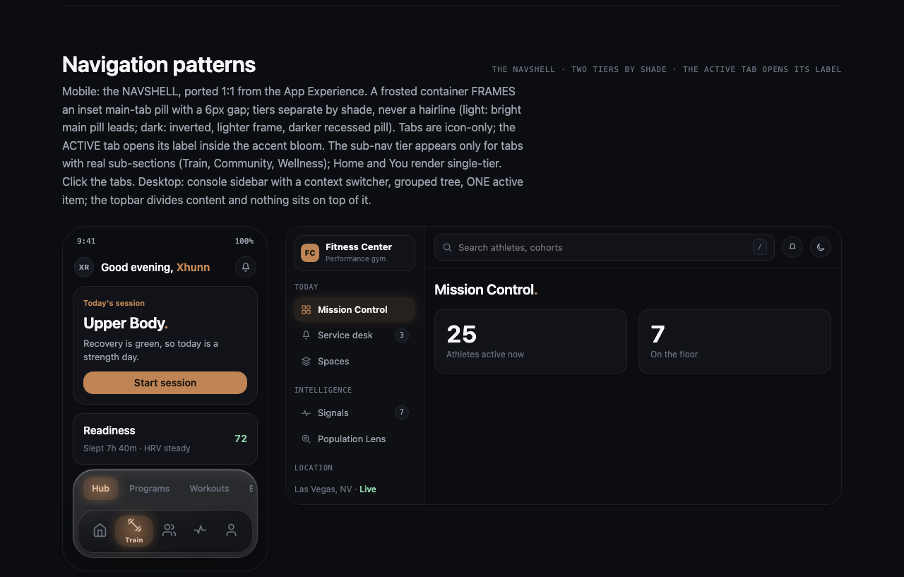

## Data presentation

Form follows the job; sequential magnitude runs ONE hue (`--data-0..3`, "volume, never type");
every chart ends with a takeaway that labels the meaning, not the axis.

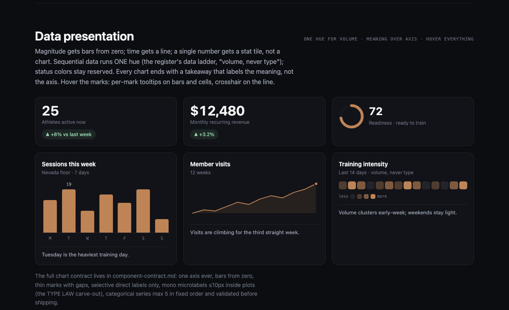

## Theming

A brand joins by THEME: a `theme.css` of value overrides living with the brand, plus a
human-readable `design-register.md` beside it. Roles and the contract are never redefined.
Full guide with the onboarding checklist: [docs/theming.md](docs/theming.md).

```css
/* theme.css — scope every override under the brand attribute */
[data-brand="acme"] {
  --accent: #0E7AFF;
  --accent-hover: #3E93FF;
  --accent-ink: #FFFFFF;
  --r-sm: 8px; --r-md: 12px; --r-lg: 18px;
  /* banning a material? NULL its tokens, don't just skip them: */
  --glass-blur: 0px; --accent-bloom: none; --glass-shadow: none;
}
[data-brand="acme"][data-theme="light"] {
  --accent: #0B5ECC;
}
```

```html
<html data-brand="acme" data-theme="light">
```

Themes may re-value or null the signature's soft-glass material (an opaque brand nulls it);
the craft laws (type, seams, contrast floors, states) are not deviable. Deviations carry a
stated reason in the register. Theme devices stay theme-owned — e.g. UFITRA's matte accent-fill
gradient and bloom:

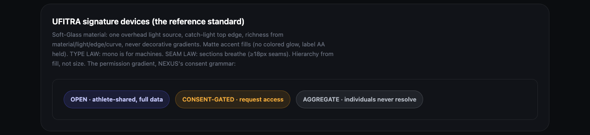

A theme can re-value the entire system, down to a light-native paper floor and its own faces
(CandyCeuticals):

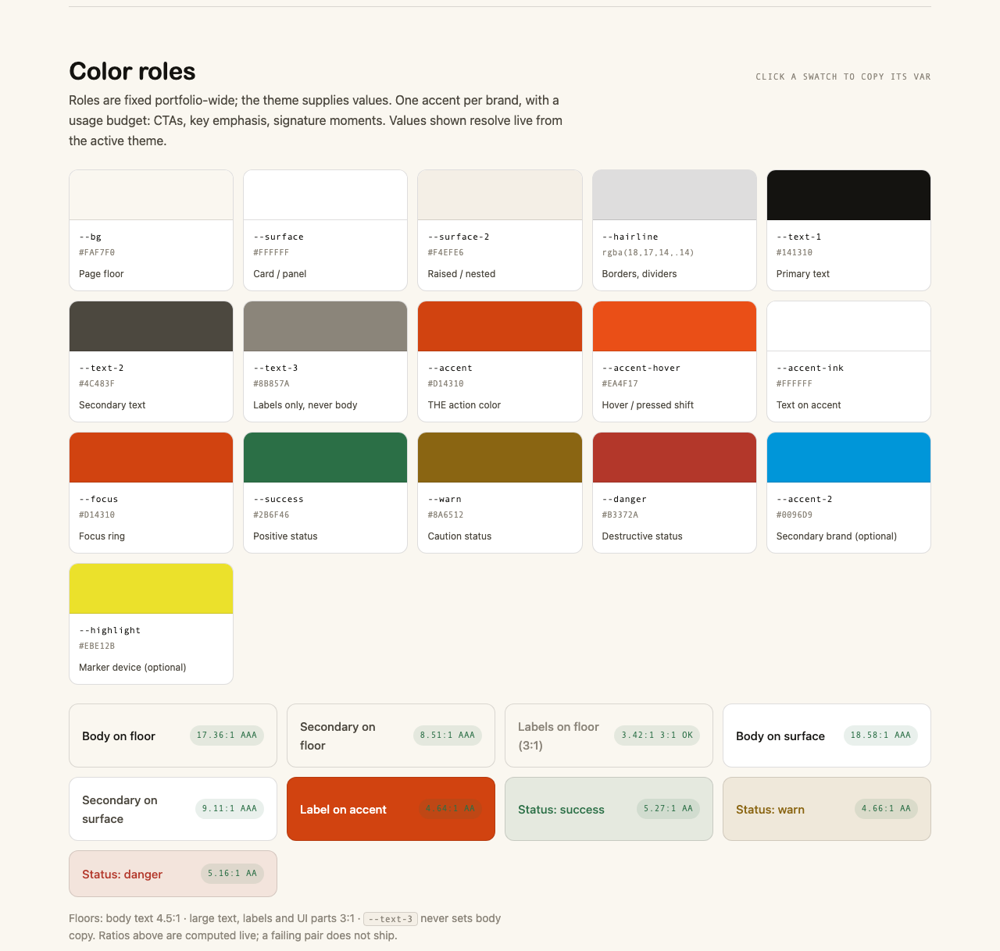

## The gate suite

Four gates, ratified 2026-08-31: hex (off-token colors), contrast (the 4.5:1 / 3:1
floors on both themes and every brand block; no exception marker, craft law), spacing
(inline margin/padding/gap breaks the seam law; `sp-ok` to ratify), and type (off-token
faces and sub-9.5px sizes; `type-ok` to ratify). `verseva-gate` runs all four with one
argument set.

"No hand-picked hexes" as pipeline, not doctrine. The hex gate reads every hex in your tokens
files, scans the source tree (`.css/.scss/.ts/.tsx/.js/.jsx/.mjs/.cjs/.html`, including
Tailwind arbitrary values like `bg-[#12E4B0]`), and exits 1 on anything off-token:

```json
"scripts": {
  "gate": "verseva-gate --tokens node_modules/@verseva/design/tokens.css --tokens src/app/theme.css src",
  "build": "npm run gate && next build"
}
```

```
$ npm run lint:hex

verseva-hex-gate: 2 off-token hexes

  src/legacy/promo.css:2  #FF00AA
  src/app/page.tsx:2  #12E4B0

Draw the value from tokens.css / the brand theme, or mark a ratified exception with "hex-ok".
```

A ratified exception carries `hex-ok` on the line with a reason in the adjacent comment.
`--allow <path-substring>` (repeatable) skips whole files, for vendored or generated paths.
All-digit 3/4-char matches (`#123`) are ignored so issue references don't trip it.

## The board

The live render of this entire package: every role, every component in every state, every
theme, with live WCAG ratios and click-to-copy variables. It runs from a clone of this repo
(it is not shipped in the npm package) and needs `python3` on PATH:

```bash
npm run board        # then open http://localhost:4390/board/
```

Brand themes are pulled from a machine-local `board/theme-manifest.json` (copy
`theme-manifest.example.json` and point it at your `theme.css` files). Without one, or for any
missing file, the board still runs and renders the signature Baseline for those brands.

Deep-linkable: `?brand=ufitra&theme=light&at=navigation`. The board is the render, never the
source: values come in by `<link>` from `tokens.css` and the pulled theme files, so what you
see IS what ships.

## Docs

| Doc | What |
|---|---|
| [docs/tokens.md](docs/tokens.md) | Every role, its meaning, and the rules per group |
| [docs/component-contract.md](docs/component-contract.md) | What every component owes the user, per component |
| [docs/laws.md](docs/laws.md) | The 13 signature laws (TYPE LAW, SEAM LAW, nav-tier-brightness, …) |
| [docs/theming.md](docs/theming.md) | Authoring a brand theme: scoping, bans, the onboarding checklist |

## Versioning

Every ratified change to the system ships as a tagged release
([Releases](https://github.com/verseva/design/releases) hold the changelog); a
version bump IS the ratification event. Consumers pin tags and upgrade deliberately: with the
hex gate wired into builds, value changes are breaking by design.

| Bump | Means |
|---|---|
| **patch** | Docs, screenshots, board; no token or contract change |
| **minor** | Additive: a new role, a new component recipe, a new doc |
| **major** | Value re-ratification or any role/contract break |

Releases also publish to GitHub Packages (`.github/workflows/publish.yml`). To consume as a
registry dependency instead of a git URL:

```ini
# .npmrc (NPM_TOKEN = a token with read:packages)
@verseva:registry=https://npm.pkg.github.com
//npm.pkg.github.com/:_authToken=${NPM_TOKEN}
```

```json
"devDependencies": { "@verseva/design": "^0.1.1" }
```

On Vercel, set `NPM_TOKEN` in the project env and the same `.npmrc` just works.

## Rules of the repo

- `tokens.css` + `docs/*.md` are the source; the board is the render; divergence is a defect.
- Roles are fixed. A new role lands here for every brand, or not at all. Values change by
  ratification; PROPOSED values are labeled until ratified.
- Signature components (the navshell above all) get copied from `components.css` verbatim,
  never approximated.
- Zero visual change was the extraction constraint (2026-08-22); diffs against the
  pre-package Baseline are defects.
- Screenshots in `docs/media/` are crops of the served board at 1280px; re-capture them when
  the board changes so this page stays true.
